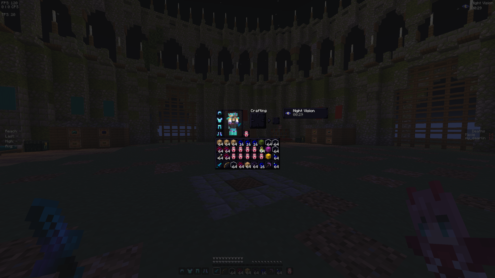
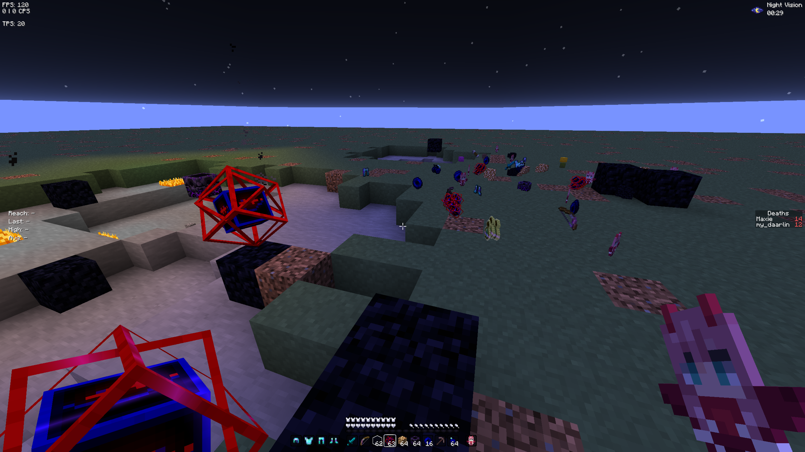

<p align="center">
  
</p>

<br>

<p align="center">
  <a href="https://fabricmc.net/"></a> <a href="https://www.minecraft.net/en-us/article/minecraft-java-edition-1-21-10"></a> <a href="https://modrinth.com"></a> <a href="https://packwiz.infra.link/"></a> <a href="https://github.com/my-daarlin/velarium"></a>
</p>

<br>

TODO: Description

<!-- MODRINTH_REMOVE_START -->

## 📦 Installation

### 💚 [Modrinth Launcher](https://modrinth.com/app)

1. Search for **Velarium**, or visit [the website](https://modrinth.com) TODO
2. Click **Install**

### 💙 [Prism Launcher](https://prismlauncher.org/)

1. Click on _Add Instance_ in the top left corner
2. Click on **Modrinth** in the left sidebar
3. Search for Velarium, look for the project icon

<!-- MODRINTH_REMOVE_END -->

## 📜 Mod List

This is a list of all content included in the modpack with names and source links.

### 💚 Modrinth Content

Modrinth content in it's latest versions. Managed by `packwiz`.

<!-- MODLIST_START -->

| Name                                        | Type        | Source                                        |
| ------------------------------------------- | ----------- | --------------------------------------------- |
| "Limitless" Banners                         | Mod         | [Modrinth](https://modrinth.com/mod/z4zsMANd) |
| Architectury API                            | Mod         | [Modrinth](https://modrinth.com/mod/lhGA9TYQ) |
| BadOptimizations                            | Mod         | [Modrinth](https://modrinth.com/mod/g96Z4WVZ) |
| Bat Membrane (No Phantoms)                  | Mod         | [Modrinth](https://modrinth.com/mod/vz3NiXrd) |
| Better Block Entities                       | Mod         | [Modrinth](https://modrinth.com/mod/ONZm0H7Y) |
| BoxHud                                      | Mod         | [Modrinth](https://modrinth.com/mod/gjFWUARA) |
| BoxLib                                      | Mod         | [Modrinth](https://modrinth.com/mod/HAE5KvTA) |
| Concurrent Chunk Management Engine (Fabric) | Mod         | [Modrinth](https://modrinth.com/mod/VSNURh3q) |
| Carpet                                      | Mod         | [Modrinth](https://modrinth.com/mod/TQTTVgYE) |
| Clearviews                                  | Mod         | [Modrinth](https://modrinth.com/mod/TwYypE5e) |
| ClickThrough Plus                           | Mod         | [Modrinth](https://modrinth.com/mod/fJi8nm80) |
| Cloth Config API                            | Mod         | [Modrinth](https://modrinth.com/mod/9s6osm5g) |
| Collective                                  | Mod         | [Modrinth](https://modrinth.com/mod/e0M1UDsY) |
| Continuity                                  | Mod         | [Modrinth](https://modrinth.com/mod/1IjD5062) |
| CustomSkinLoader                            | Mod         | [Modrinth](https://modrinth.com/mod/idMHQ4n2) |
| Entity Culling                              | Mod         | [Modrinth](https://modrinth.com/mod/NNAgCjsB) |
| Fabric API                                  | Mod         | [Modrinth](https://modrinth.com/mod/P7dR8mSH) |
| Fabric Language Kotlin                      | Mod         | [Modrinth](https://modrinth.com/mod/Ha28R6CL) |
| Fancy Entity Renderer                       | Mod         | [Modrinth](https://modrinth.com/mod/RQ6INv2n) |
| FancyMenu                                   | Mod         | [Modrinth](https://modrinth.com/mod/Wq5SjeWM) |
| FerriteCore                                 | Mod         | [Modrinth](https://modrinth.com/mod/uXXizFIs) |
| Freecam                                     | Mod         | [Modrinth](https://modrinth.com/mod/XeEZ3fK2) |
| HUD Lib                                     | Mod         | [Modrinth](https://modrinth.com/mod/dWIHwNEE) |
| ImmediatelyFast                             | Mod         | [Modrinth](https://modrinth.com/mod/5ZwdcRci) |
| Jade 🔍                                     | Mod         | [Modrinth](https://modrinth.com/mod/nvQzSEkH) |
| Konkrete                                    | Mod         | [Modrinth](https://modrinth.com/mod/J81TRJWm) |
| libIPN                                      | Mod         | [Modrinth](https://modrinth.com/mod/onSQdWhM) |
| Litematica                                  | Mod         | [Modrinth](https://modrinth.com/mod/bEpr0Arc) |
| Lithium                                     | Mod         | [Modrinth](https://modrinth.com/mod/gvQqBUqZ) |
| MaLiLib                                     | Mod         | [Modrinth](https://modrinth.com/mod/GcWjdA9I) |
| Melody                                      | Mod         | [Modrinth](https://modrinth.com/mod/CVT4pFB2) |
| MiniHUD                                     | Mod         | [Modrinth](https://modrinth.com/mod/UMxybHE8) |
| Mod Menu                                    | Mod         | [Modrinth](https://modrinth.com/mod/mOgUt4GM) |
| Mouse Tweaks                                | Mod         | [Modrinth](https://modrinth.com/mod/aC3cM3Vq) |
| No Fortune Chest                            | Mod         | [Modrinth](https://modrinth.com/mod/4QufRNTv) |
| NoRecipeBook                                | Mod         | [Modrinth](https://modrinth.com/mod/TvL1V8O5) |
| OfflineLAN                                  | Mod         | [Modrinth](https://modrinth.com/mod/pimmstPB) |
| Text Placeholder API                        | Mod         | [Modrinth](https://modrinth.com/mod/eXts2L7r) |
| Reese's Sodium Options                      | Mod         | [Modrinth](https://modrinth.com/mod/Bh37bMuy) |
| Shulker Box Tooltip                         | Mod         | [Modrinth](https://modrinth.com/mod/2M01OLQq) |
| Sodium Extra                                | Mod         | [Modrinth](https://modrinth.com/mod/PtjYWJkn) |
| Sodium                                      | Mod         | [Modrinth](https://modrinth.com/mod/AANobbMI) |
| Tweakeroo                                   | Mod         | [Modrinth](https://modrinth.com/mod/t5wuYk45) |
| ukulib                                      | Mod         | [Modrinth](https://modrinth.com/mod/Y8uFrUil) |
| uku's Armor HUD                             | Mod         | [Modrinth](https://modrinth.com/mod/wF189hn9) |
| Very Many Players (Fabric)                  | Mod         | [Modrinth](https://modrinth.com/mod/wnEe9KBa) |
| Armor HUD                                   | Mod         | [Modrinth](https://modrinth.com/mod/wAk5JZkv) |
| WI Zoom                                     | Mod         | [Modrinth](https://modrinth.com/mod/o7DitHWP) |
| WorldEdit                                   | Mod         | [Modrinth](https://modrinth.com/mod/1u6JkXh5) |
| YetAnotherConfigLib (YACL)                  | Mod         | [Modrinth](https://modrinth.com/mod/1eAoo2KR) |
| 1.20 panorama with shaders (night)          | Texturepack | [Modrinth](https://modrinth.com/mod/HmYNU7gu) |
| Fast Better Grass                           | Texturepack | [Modrinth](https://modrinth.com/mod/dspVZXKP) |
| Life Series Armor                           | Texturepack | [Modrinth](https://modrinth.com/mod/ZL71UjPM) |
| Nebula Panorama                             | Texturepack | [Modrinth](https://modrinth.com/mod/obmqZM8J) |
| PvP Scroutopia                              | Texturepack | [Modrinth](https://modrinth.com/mod/Dah9yFTO) |
| sound+                                      | Texturepack | [Modrinth](https://modrinth.com/mod/pg1LsznA) |
| totem zero two                              | Texturepack | [Modrinth](https://modrinth.com/mod/K41qzD5k) |
| Volcanic Dark                               | Texturepack | [Modrinth](https://modrinth.com/mod/ztFWd0Qq) |

<!-- MODLIST_END -->

## 📈 Performance data

_(Coming soon – will include how much fps it gets where)_

<!-- MODRINTH_REMOVE_START -->
<!-- Removed, because Modrinth has a Gallery tab -->

## 📸 Screenshots

<p align="center">
    
    
</p>
<p align="center">
    
    
</p>

## 🧑‍💻 Development Guide

Starlight uses [Packwiz](https://packwiz.infra.link/) for modpack management. This allows simple mod additions, version locking, and repeatable builds via Git. To install it, first [install the Go language](https://go.dev/doc/install) and then run this command:

```bash
go install github.com/packwiz/packwiz@latest
```

### 💚 Adding Modrinth content

```bash
packwiz modrinth add <mod-slug>
```

This will create a `.toml` file in `mods/` for mods, `resourcepacks/` for resource packs, and `shaderpacks/` for shaderpacks.

> [!WARNING]
> Do not use any other packwiz library other than Modrinth (Curseforge etc.). It would break all the project automatization and scripts. Add it like you would add custom content.

### 💜 Adding custom content

There is an `override` folder in the project. Everything from there will get merged with the project files during packaging. For example if I have a custom mod, I will place it in `overrides/mods/mod.jar` and during packaging, it will be put into `mods/mod.jar`. You can also use it for other custom content, like default option file (should be in `overrides/options.txt`) or the config directory.

### ↔️ Update All Modrinth Mods

```bash
packwiz update -a
```

### 📆 Export

To generate a `.mrpack` file for Modrinth or manual distribution, use the `package.sh` script. To run it, go to the project root, and execute the following:

```bash
chmod +x ./package.sh
./package.sh
```

This will include:

- All mod `.jar` links and metadata
- Everything from the `overrides/` folder (config, resourcepacks, etc.)
- Anything else in the repository not included in the `.packwizignore` file

### Changing the modpack to a different version

To change the modpack to a diffeent version of Minecraft, firts run the `test-update.py` script, that will check what mods have an existing version for the target Minecraft version. To run the script use the following command, an example to check the modpacks compability with the Minecraft 1.21.4 version:

**macOS/Linux**

```bash
python3 scripts/test-update.py -v 1.21.4
```

**Windows (run in PowerShell)**

```powershell
py scripts\test-update.py -v 1.21.4
```

The script also has an optional `-f` flag that can be used to check for multiple updates at once. If you add the `-f` flag to the command above, it will check from the minecraft version 1.21.4 all the way up to the latest version of Minecraft released, at the time of writing this 1.21.8. This is mainly use to check how much you can update the modpack without breaking too many mods in the modpack.

<br>

If all mods have a compatible version for the Minecraft version you want to update to, go to the [pack.toml](./pack.toml) file, and look for the `minecraft` field under the `versions` section. Change that to your desired Minecraft version, and then update the modpack using the following command:

```bash
packwiz update -a
```

> [!WARNING]
> This only updates content managed by `packwiz`, all external content has to be updated manually!

### Python Scripts

There are some Python scripts in this repo to help automate redundant tasks, such as modlist creation, or making the Modrinth `README`. These scripts use a Python virtual environment with dependencies specified in [`requirements.txt`](./requirements.txt).

#### 🔧 First-time setup (after cloning the repo)

Run these commands in the project root:

**macOS/Linux**

```bash
python3 -m venv .venv               # Create a new virtual environment
source .venv/bin/activate           # Activate it
pip install -r requirements.txt     # Install all required dependencies
```

**Windows (PowerShell)**

```powershell
py -m venv .venv                    # Create a new virtual environment
.venv\Scripts\Activate.ps1          # Activate it
pip install -r requirements.txt     # Install all required dependencies
```

#### 🚀 Every time you want to use the scripts

You only need to activate the venv:

```bash
source .venv/bin/activate
```

or on **Windows**:

```
.venv\Scripts\Activate.ps1
```

#### 📦 When you’re done

You can deactivate the virtual environment with:

```bash
deactivate
```

<!-- MODRINTH_REMOVE_END -->

## 🌐 Credits & Resources

- This modpack uses mods and resource packs from [Modrinth](https://modrinth.com/), a community-driven platform for Minecraft modding.
- The Starlight logo was created using [Blockbench](https://www.blockbench.net/) with a Minecraft text plugin. There is a video explaining how to do this [here](https://www.youtube.com/watch?v=iGaufrACVj4).

All mods are managed via [Packwiz](https://packwiz.infra.link/).

## 🧷 License

This project is open-source and intended for educational and personal use. All content included in the Velarium modpack remains under its respective license. Be kind, give credit, and have fun 🌱
